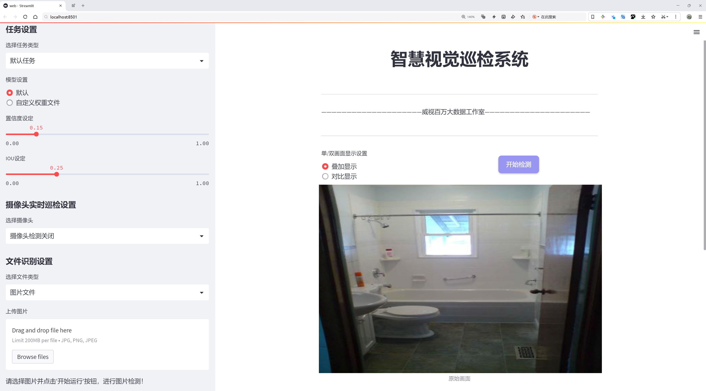
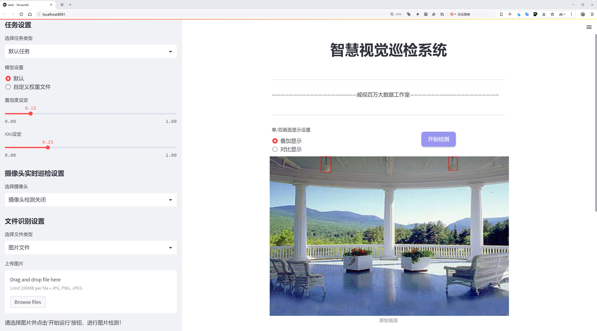
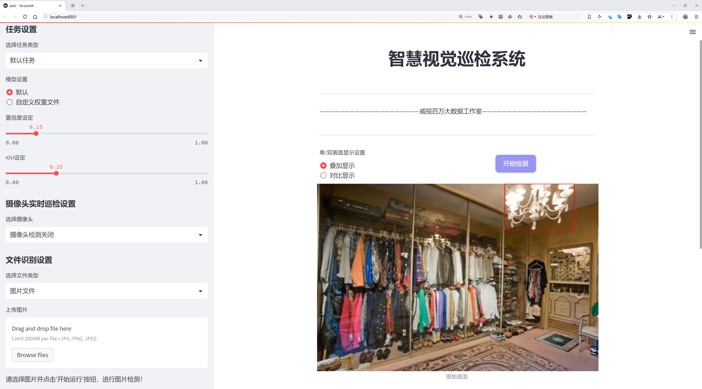
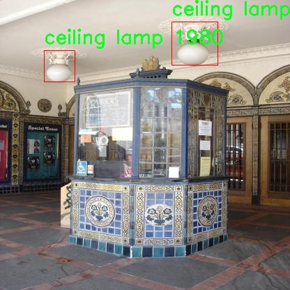
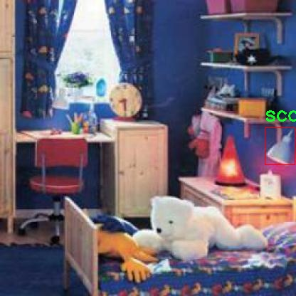
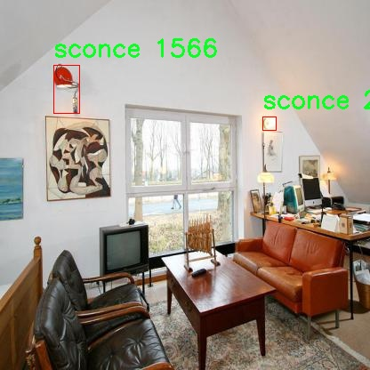
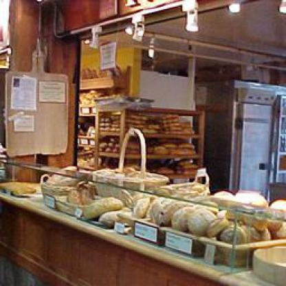

# 室内灯具检测检测系统源码分享
 # [一条龙教学YOLOV8标注好的数据集一键训练_70+全套改进创新点发刊_Web前端展示]

### 1.研究背景与意义

项目参考[AAAI Association for the Advancement of Artificial Intelligence](https://gitee.com/qunshansj/projects)

项目来源[AACV Association for the Advancement of Computer Vision](https://gitee.com/qunmasj/projects)

研究背景与意义

随着智能家居和物联网技术的迅速发展，室内环境的智能化管理逐渐成为研究的热点之一。在这一背景下，室内灯具的智能检测与识别技术显得尤为重要。灯具不仅是室内照明的核心组成部分，更是家居美学的重要体现。准确、高效地识别和分类各种灯具，不仅可以提升智能家居系统的用户体验，还能为室内环境的优化提供数据支持。因此，开发基于先进深度学习技术的室内灯具检测系统具有重要的理论价值和实际意义。

近年来，YOLO（You Only Look Once）系列目标检测算法因其高效性和实时性受到广泛关注。YOLOv8作为该系列的最新版本，进一步提升了检测精度和速度，适用于复杂的室内环境。然而，传统YOLOv8在特定场景下的应用仍然存在一定的局限性，尤其是在灯具种类繁多、形态各异的情况下。因此，针对室内灯具的特征进行改进和优化，是提升检测系统性能的关键所在。

本研究基于改进YOLOv8算法，构建一个专门针对室内灯具的检测系统。所使用的数据集“gelbertconlampara2”包含2300张高质量图像，涵盖了五类灯具：枝形吊灯、天花板灯、吊灯、壁灯和架子灯。这些类别的多样性为模型的训练提供了丰富的样本，有助于提高模型的泛化能力和识别准确率。此外，数据集中每类灯具的图像数量相对均衡，能够有效避免因样本不均衡导致的模型偏差问题。

在研究过程中，我们将通过数据增强、特征提取和模型优化等手段，提升YOLOv8在室内灯具检测中的表现。通过对不同灯具的形状、颜色、光影等特征进行深入分析，改进模型的特征提取能力，使其能够在复杂的室内环境中实现高效、准确的灯具识别。这不仅能够为智能家居系统提供更为精准的灯具管理方案，还能为后续的室内环境智能化研究奠定基础。

此外，本研究的成果将为相关领域的研究者提供有价值的参考，推动目标检测技术在室内环境中的应用发展。随着数据集的不断丰富和算法的持续优化，室内灯具检测系统有望在未来实现更广泛的应用，包括但不限于智能家居、室内设计、环境监测等领域。

综上所述，基于改进YOLOv8的室内灯具检测系统的研究，不仅具有重要的学术价值，也为实际应用提供了切实可行的解决方案。通过对灯具的智能识别与管理，我们将推动智能家居的发展，提升人们的生活质量，为实现更为智能化的居住环境贡献力量。

### 2.图片演示







##### 注意：由于此博客编辑较早，上面“2.图片演示”和“3.视频演示”展示的系统图片或者视频可能为老版本，新版本在老版本的基础上升级如下：（实际效果以升级的新版本为准）

  （1）适配了YOLOV8的“目标检测”模型和“实例分割”模型，通过加载相应的权重（.pt）文件即可自适应加载模型。

  （2）支持“图片识别”、“视频识别”、“摄像头实时识别”三种识别模式。

  （3）支持“图片识别”、“视频识别”、“摄像头实时识别”三种识别结果保存导出，解决手动导出（容易卡顿出现爆内存）存在的问题，识别完自动保存结果并导出到tempDir中。

  （4）支持Web前端系统中的标题、背景图等自定义修改，后面提供修改教程。

  另外本项目提供训练的数据集和训练教程,暂不提供权重文件（best.pt）,需要您按照教程进行训练后实现图片演示和Web前端界面演示的效果。

### 3.视频演示

[3.1 视频演示](https://www.bilibili.com/video/BV1xvthetEy1/)

### 4.数据集信息展示

##### 4.1 本项目数据集详细数据（类别数＆类别名）

nc: 4
names: ['Branches', 'ceiling lamp', 'chandelier', 'sconce']


##### 4.2 本项目数据集信息介绍

数据集信息展示

在本研究中，我们采用了名为“gelbertconlampara2”的数据集，以训练和改进YOLOv8模型，旨在提升室内灯具的检测精度和效率。该数据集专注于室内照明设备的多样性，涵盖了四个主要类别，分别是“Branches”（枝形灯）、“ceiling lamp”（天花板灯）、“chandelier”（吊灯）和“sconce”（壁灯）。这些类别不仅代表了现代室内设计中常见的灯具类型，也反映了不同照明需求和装饰风格的多样性。

“gelbertconlampara2”数据集的构建过程充分考虑了室内环境的复杂性和灯具的多样性。每个类别的样本均经过精心挑选，确保涵盖不同的设计风格、材质和颜色，使得模型在训练过程中能够学习到更为丰富的特征。这种多样性对于提高YOLOv8在实际应用中的泛化能力至关重要，尤其是在面对不同光照条件和背景环境时，模型能够更好地识别和定位各种灯具。

数据集中每个类别的样本数量和质量都经过严格审核，以确保其标注的准确性和一致性。每个灯具类别的图像均包含多种拍摄角度和环境设置，力求模拟真实的室内场景。这种多样化的图像数据不仅提升了模型的训练效果，也为后续的验证和测试提供了坚实的基础。通过这种方式，我们能够确保模型在面对实际应用场景时，能够有效地识别出不同类型的灯具。

在数据集的使用过程中，我们特别关注了图像的分辨率和清晰度，这对于目标检测任务的成功至关重要。高质量的图像能够帮助YOLOv8模型更好地提取特征，从而提高检测的准确性。此外，数据集中的每个图像都配有详细的标注信息，包括灯具的类别、位置和边界框，这些信息为模型的训练提供了必要的监督信号。

为了进一步增强模型的鲁棒性，我们还考虑了数据增强技术的应用。通过对“gelbertconlampara2”数据集中的图像进行旋转、缩放、裁剪和颜色调整等处理，我们能够生成更多的训练样本。这种方法不仅丰富了训练数据的多样性，还有效地减少了模型对特定样本的过拟合风险，使得最终的检测系统在不同场景下均能保持良好的性能。

综上所述，“gelbertconlampara2”数据集为本研究提供了一个坚实的基础，使得我们能够在改进YOLOv8的室内灯具检测系统的过程中，充分利用其丰富的类别信息和高质量的图像数据。通过对该数据集的深入分析和应用，我们期待能够显著提升室内灯具的检测能力，为智能家居和室内设计领域的进一步发展提供支持。










### 5.全套项目环境部署视频教程（零基础手把手教学）

[5.1 环境部署教程链接（零基础手把手教学）](https://www.ixigua.com/7404473917358506534?logTag=c807d0cbc21c0ef59de5)


[5.2 安装Python虚拟环境创建和依赖库安装视频教程链接（零基础手把手教学）](https://www.ixigua.com/7404474678003106304?logTag=1f1041108cd1f708b01a)

### 6.手把手YOLOV8训练视频教程（零基础小白有手就能学会）

[6.1 手把手YOLOV8训练视频教程（零基础小白有手就能学会）](https://www.ixigua.com/7404477157818401292?logTag=d31a2dfd1983c9668658)

### 7.70+种全套YOLOV8创新点代码加载调参视频教程（一键加载写好的改进模型的配置文件）

[7.1 70+种全套YOLOV8创新点代码加载调参视频教程（一键加载写好的改进模型的配置文件）](https://www.ixigua.com/7404478314661806627?logTag=29066f8288e3f4eea3a4)

### 8.70+种全套YOLOV8创新点原理讲解（非科班也可以轻松写刊发刊，V10版本正在科研待更新）

由于篇幅限制，每个创新点的具体原理讲解就不一一展开，具体见下列网址中的创新点对应子项目的技术原理博客网址【Blog】：


[8.1 70+种全套YOLOV8创新点原理讲解链接](https://gitee.com/qunmasj/good)

### 9.系统功能展示（检测对象为举例，实际内容以本项目数据集为准）

图9.1.系统支持检测结果表格显示

  图9.2.系统支持置信度和IOU阈值手动调节

  图9.3.系统支持自定义加载权重文件best.pt(需要你通过步骤5中训练获得)

  图9.4.系统支持摄像头实时识别

  图9.5.系统支持图片识别

  图9.6.系统支持视频识别

  图9.7.系统支持识别结果文件自动保存

  图9.8.系统支持Excel导出检测结果数据


### 10.原始YOLOV8算法原理

原始YOLOv8算法原理

YOLOv8算法作为目标检测领域的最新进展，建立在YOLOv5的基础上，经过了一系列的优化与改进，旨在提升目标检测的速度与精度。该算法的设计理念围绕着轻量化、快速性和高效性展开，特别适合在资源受限的环境中应用。YOLOv8的网络结构主要由三个部分组成：Backbone（主干网络）、Neck（特征融合层）和Head（检测头），这三部分相辅相成，共同构成了YOLOv8的核心。

在Backbone部分，YOLOv8采用了C2F模块替代了YOLOv5中的C3模块。C2F模块的设计灵感来源于CSPNet，旨在通过并行的梯度流分支提取更丰富的特征信息。这种结构不仅提高了特征提取的效率，还有效减小了网络的复杂度。具体而言，C2F模块通过3×3的卷积操作，结合深度可分离卷积的思想，增强了模型对特征的学习能力。此外，YOLOv8还引入了快速空间金字塔池化（SPPF）模块，进一步提升了对多尺度特征的处理能力，使得模型在面对不同大小的目标时，能够保持良好的检测性能。

Neck部分则是YOLOv8的另一大亮点。该部分采用了多尺度特征融合技术，结合了特征金字塔网络（FPN）和路径聚合网络（PAN），有效地将来自Backbone不同阶段的特征图进行融合。这种融合策略使得YOLOv8能够更好地捕捉到不同尺度目标的信息，从而提升了目标检测的性能和鲁棒性。为了进一步提高特征融合的效率，YOLOv8还引入了BiFPN网络，通过高效的双向跨尺度连接和加权特征融合，显著提升了模型对不同尺度特征信息的提取速度。

在Head部分，YOLOv8实现了从耦合头（Coupled-Head）到解耦头（Decoupled-Head）的转变。传统的耦合头结构将目标检测和分类任务合并在同一个卷积层中，而YOLOv8则将这两个任务分开处理，分别使用不同的卷积路径进行特征提取。这种解耦设计不仅提高了模型的灵活性，还使得网络在处理复杂场景时能够更快地聚焦于目标的关键特征。此外，YOLOv8抛弃了传统的基于锚框（Anchor-Based）的方法，转而采用无锚框（Anchor-Free）策略，将目标检测转化为关键点检测。这一创新使得模型在训练过程中不再依赖于预设的锚框，从而提升了模型的泛化能力和简洁性。

在输入处理方面，YOLOv8默认采用640×640的图像尺寸进行训练和推理，但在实际应用中，针对不同长宽比的图像，YOLOv8实现了自适应的图像缩放策略。这种策略通过将长边按比例缩小到指定尺寸，并对短边进行填充，最大限度地减少了信息冗余，提高了目标检测的速度和准确性。此外，YOLOv8还引入了Mosaic图像增强技术，通过随机拼接多张图像，迫使模型学习到不同位置和周围像素的特征，从而进一步提升了模型的预测精度。

在损失函数的设计上，YOLOv8也进行了创新。为了应对训练和推理过程中可能出现的逻辑不一致性，YOLOv8取消了Obj分支，采用了BCELoss（Binary Cross Entropy Loss）用于分类分支，而在边界框回归分支中则使用了DFL（Distribution Focal Loss）和CIoULoss（Complete Intersection over Union Loss）。这种损失函数的设计旨在使网络模型更快地聚焦于标签附近的数值，提高目标检测的精度。

总的来说，YOLOv8算法通过一系列的结构优化和创新，极大地提升了目标检测的性能和灵活性。其轻量化的设计使得模型能够在多种应用场景中高效运行，特别是在实时目标检测、图像分割和图像分类等任务中展现出卓越的表现。随着YOLOv8的广泛应用，目标检测技术的研究与实践将迎来新的发展机遇。


### 11.项目核心源码讲解（再也不用担心看不懂代码逻辑）

#### 11.1 70+种YOLOv8算法改进源码大全和调试加载训练教程（非必要）\ultralytics\models\nas\__init__.py

下面是对提供代码的逐行分析和核心部分的保留，同时添加了详细的中文注释：

```python
# Ultralytics YOLO 🚀, AGPL-3.0 license

# 从当前包中导入 NAS 模型
from .model import NAS

# 从当前包中导入 NAS 预测器
from .predict import NASPredictor

# 从当前包中导入 NAS 验证器
from .val import NASValidator

# 定义当前模块的公开接口，允许外部访问 NASPredictor、NASValidator 和 NAS
__all__ = 'NASPredictor', 'NASValidator', 'NAS'
```

### 代码分析与注释：

1. **导入模块**：
   - `from .model import NAS`：从当前包的 `model` 模块中导入 `NAS` 类或函数，这通常是一个神经网络模型的定义。
   - `from .predict import NASPredictor`：从当前包的 `predict` 模块中导入 `NASPredictor` 类或函数，负责使用 `NAS` 模型进行预测。
   - `from .val import NASValidator`：从当前包的 `val` 模块中导入 `NASValidator` 类或函数，负责验证模型的性能。

2. **定义公开接口**：
   - `__all__ = 'NASPredictor', 'NASValidator', 'NAS'`：这是一个特殊的变量，用于定义当前模块的公共接口。只有在使用 `from module import *` 语句时，列出的名称才会被导入。这有助于控制模块的命名空间，避免不必要的名称泄露。

### 核心部分总结：
- 该代码主要用于组织和导入与 NAS（神经架构搜索）相关的模型、预测和验证功能。通过定义 `__all__`，它明确了哪些部分可以被外部使用，增强了模块的封装性。

这个文件是一个Python模块的初始化文件，通常命名为`__init__.py`，用于标识一个目录为Python包。在这个特定的文件中，主要涉及到Ultralytics YOLO（You Only Look Once）算法的一个改进版本，具体是与神经架构搜索（NAS，Neural Architecture Search）相关的内容。

文件的开头有一行注释，指出该项目是Ultralytics YOLO的实现，并且使用的是AGPL-3.0许可证。这意味着该代码是开源的，用户可以自由使用和修改，但需要遵循该许可证的条款。

接下来，文件通过`from`语句导入了三个组件：`NAS`、`NASPredictor`和`NASValidator`。这些组件分别来自于同一包中的不同模块。`NAS`可能是一个类或函数，负责实现神经架构搜索的核心逻辑；`NASPredictor`则可能是一个用于进行预测的类，基于NAS模型进行推理；而`NASValidator`则可能用于验证模型的性能或准确性。

最后，`__all__`变量定义了当使用`from module import *`语句时，哪些名称会被导入。在这里，`__all__`包含了`NASPredictor`、`NASValidator`和`NAS`，这意味着这三个组件是该模块的公共接口，用户可以直接使用它们。

总体来说，这个`__init__.py`文件的作用是将与NAS相关的功能模块整合到一个包中，方便用户导入和使用。

#### 11.2 ui.py

```python
import sys
import subprocess

def run_script(script_path):
    """
    使用当前 Python 环境运行指定的脚本。

    Args:
        script_path (str): 要运行的脚本路径

    Returns:
        None
    """
    # 获取当前 Python 解释器的路径
    python_path = sys.executable

    # 构建运行命令
    command = f'"{python_path}" -m streamlit run "{script_path}"'

    # 执行命令
    result = subprocess.run(command, shell=True)
    if result.returncode != 0:
        print("脚本运行出错。")


# 实例化并运行应用
if __name__ == "__main__":
    # 指定您的脚本路径
    script_path = "web.py"  # 这里直接指定脚本路径

    # 运行脚本
    run_script(script_path)  # 调用函数运行指定的脚本
```

### 代码核心部分注释：

1. **导入模块**：
   - `import sys`: 导入 `sys` 模块，用于访问与 Python 解释器相关的变量和函数。
   - `import subprocess`: 导入 `subprocess` 模块，用于执行外部命令。

2. **定义 `run_script` 函数**：
   - 该函数接受一个参数 `script_path`，表示要运行的 Python 脚本的路径。
   - 使用 `sys.executable` 获取当前 Python 解释器的路径，以确保使用正确的 Python 环境来运行脚本。
   - 构建一个命令字符串 `command`，该命令将使用 `streamlit` 模块运行指定的脚本。
   - 使用 `subprocess.run` 执行构建的命令，并通过 `shell=True` 允许在 shell 中执行命令。
   - 检查命令的返回码，如果不为 0，表示脚本运行出错，打印错误信息。

3. **主程序入口**：
   - `if __name__ == "__main__":` 确保只有在直接运行该脚本时才会执行以下代码。
   - 指定要运行的脚本路径 `script_path`，这里直接指定为 `"web.py"`。
   - 调用 `run_script` 函数，传入脚本路径以运行该脚本。

这个程序文件的主要功能是使用当前的 Python 环境来运行一个指定的脚本，具体来说是运行一个名为 `web.py` 的脚本。程序首先导入了必要的模块，包括 `sys`、`os` 和 `subprocess`，以及一个自定义的 `abs_path` 函数，用于获取文件的绝对路径。

在 `run_script` 函数中，首先获取当前 Python 解释器的路径，这通过 `sys.executable` 实现。接着，构建一个命令字符串，该命令使用 `streamlit` 模块来运行指定的脚本。这里的命令格式为 `"{python_path}" -m streamlit run "{script_path}"`，其中 `python_path` 是当前 Python 解释器的路径，`script_path` 是要运行的脚本的路径。

然后，使用 `subprocess.run` 方法来执行这个命令。`shell=True` 参数表示在一个新的 shell 中执行命令。执行后，程序会检查返回的结果码，如果不为零，说明脚本运行出错，程序会打印出相应的错误信息。

在文件的最后部分，使用 `if __name__ == "__main__":` 来确保只有在直接运行该文件时才会执行后面的代码。在这里，首先调用 `abs_path` 函数获取 `web.py` 的绝对路径，然后调用 `run_script` 函数来运行这个脚本。

总的来说，这个程序的作用是简化通过 Python 环境运行 Streamlit 应用的过程，提供了一种方便的方式来启动指定的脚本。

#### 11.3 70+种YOLOv8算法改进源码大全和调试加载训练教程（非必要）\ultralytics\nn\tasks.py

以下是经过简化并附有详细中文注释的核心代码部分：

```python
import torch
import torch.nn as nn

class BaseModel(nn.Module):
    """BaseModel类是Ultralytics YOLO系列模型的基类。"""

    def forward(self, x, *args, **kwargs):
        """
        模型的前向传播方法。

        参数:
            x (torch.Tensor | dict): 输入图像张量或包含图像张量和真实标签的字典。

        返回:
            (torch.Tensor): 网络的输出。
        """
        if isinstance(x, dict):  # 处理训练和验证时的情况
            return self.loss(x, *args, **kwargs)  # 计算损失
        return self.predict(x, *args, **kwargs)  # 进行预测

    def predict(self, x, profile=False, visualize=False, augment=False):
        """
        通过网络进行前向传播。

        参数:
            x (torch.Tensor): 输入张量。
            profile (bool): 如果为True，则打印每层的计算时间，默认为False。
            visualize (bool): 如果为True，则保存模型的特征图，默认为False。
            augment (bool): 在预测时进行图像增强，默认为False。

        返回:
            (torch.Tensor): 模型的最后输出。
        """
        if augment:
            return self._predict_augment(x)  # 进行增强预测
        return self._predict_once(x, profile, visualize)  # 进行一次预测

    def _predict_once(self, x, profile=False, visualize=False):
        """
        执行一次前向传播。

        参数:
            x (torch.Tensor): 输入张量。
            profile (bool): 如果为True，则打印每层的计算时间，默认为False。
            visualize (bool): 如果为True，则保存模型的特征图，默认为False。

        返回:
            (torch.Tensor): 模型的最后输出。
        """
        y, dt = [], []  # 输出列表和时间列表
        for m in self.model:  # 遍历模型中的每一层
            if m.f != -1:  # 如果不是来自前一层
                x = y[m.f] if isinstance(m.f, int) else [x if j == -1 else y[j] for j in m.f]  # 从早期层获取输入
            if profile:
                self._profile_one_layer(m, x, dt)  # 记录层的计算时间
            x = m(x)  # 执行前向传播
            y.append(x if m.i in self.save else None)  # 保存输出
            if visualize:
                feature_visualization(x, m.type, m.i, save_dir=visualize)  # 可视化特征图
        return x  # 返回最后的输出

    def loss(self, batch, preds=None):
        """
        计算损失。

        参数:
            batch (dict): 用于计算损失的批次数据。
            preds (torch.Tensor | List[torch.Tensor]): 预测结果。
        """
        if not hasattr(self, 'criterion'):
            self.criterion = self.init_criterion()  # 初始化损失函数

        preds = self.forward(batch['img']) if preds is None else preds  # 获取预测结果
        return self.criterion(preds, batch)  # 计算损失

    def init_criterion(self):
        """初始化BaseModel的损失标准。"""
        raise NotImplementedError('compute_loss() needs to be implemented by task heads')


class DetectionModel(BaseModel):
    """YOLOv8检测模型。"""

    def __init__(self, cfg='yolov8n.yaml', ch=3, nc=None, verbose=True):
        """使用给定的配置和参数初始化YOLOv8检测模型。"""
        super().__init__()
        self.yaml = cfg if isinstance(cfg, dict) else yaml_model_load(cfg)  # 加载配置字典

        # 定义模型
        ch = self.yaml['ch'] = self.yaml.get('ch', ch)  # 输入通道
        if nc and nc != self.yaml['nc']:
            self.yaml['nc'] = nc  # 覆盖YAML中的类别数
        self.model, self.save = parse_model(deepcopy(self.yaml), ch=ch, verbose=verbose)  # 解析模型
        self.names = {i: f'{i}' for i in range(self.yaml['nc'])}  # 默认名称字典

        # 初始化权重和偏置
        initialize_weights(self)

    def init_criterion(self):
        """初始化DetectionModel的损失标准。"""
        return v8DetectionLoss(self)  # 返回YOLOv8检测损失
```

### 代码说明：
1. **BaseModel类**：这是所有YOLO模型的基类，定义了模型的基本结构和前向传播方法。
   - `forward`方法处理输入并决定是计算损失还是进行预测。
   - `predict`方法负责执行前向传播，并可选择进行数据增强和可视化。
   - `loss`方法计算模型的损失，使用指定的损失标准。

2. **DetectionModel类**：继承自BaseModel，专门用于YOLOv8的检测任务。
   - 在初始化时加载模型配置，并解析模型结构。
   - `init_criterion`方法返回特定于检测任务的损失标准。

通过这些核心部分的注释，可以更好地理解YOLO模型的结构和功能。

这个程序文件是Ultralytics YOLOv8模型的核心部分，主要实现了模型的定义、训练和推理功能。文件中包含多个类和函数，主要用于构建YOLOv8的不同模型（如检测、分割、姿态估计和分类模型），并提供相应的损失计算、权重加载和模型信息打印等功能。

首先，文件导入了一些必要的库和模块，包括PyTorch、Ultralytics的自定义模块和工具函数。接着，定义了一个基类`BaseModel`，它是所有YOLO模型的基础。这个类实现了模型的前向传播方法`forward`，并根据输入类型（图像或字典）选择相应的处理方式。在`BaseModel`中，还定义了预测、损失计算和权重加载等方法。

在`BaseModel`的基础上，文件定义了多个具体的模型类，包括`DetectionModel`、`SegmentationModel`、`PoseModel`和`ClassificationModel`。每个模型类都实现了特定的初始化和损失计算方法。例如，`DetectionModel`类专门用于目标检测，初始化时会解析配置文件并构建模型结构，同时定义了损失函数为`v8DetectionLoss`。

此外，文件中还定义了`Ensemble`类，用于处理模型的集成。集成模型可以将多个模型的输出结合起来，以提高预测的准确性和鲁棒性。

文件的后半部分包含了一些辅助函数，如`torch_safe_load`用于安全加载模型权重，`attempt_load_weights`和`attempt_load_one_weight`用于加载单个或多个模型的权重，并进行必要的兼容性更新。还有`parse_model`函数用于解析YOLO模型的配置字典并构建相应的PyTorch模型。

最后，文件还包含了一些工具函数，如`yaml_model_load`用于从YAML文件加载模型配置，`guess_model_scale`和`guess_model_task`用于推测模型的规模和任务类型。这些工具函数为模型的使用和配置提供了便利。

总体而言，这个文件是YOLOv8模型实现的核心，涵盖了模型的构建、训练、推理和损失计算等多个方面，为用户提供了灵活的模型使用方式。

#### 11.4 code\ultralytics\solutions\ai_gym.py

以下是经过简化和注释的核心代码部分，保留了主要功能并添加了详细的中文注释：

```python
import cv2
from ultralytics.utils.checks import check_imshow
from ultralytics.utils.plotting import Annotator

class AIGym:
    """用于管理实时视频流中人们的健身动作计数的类。"""

    def __init__(self):
        """初始化 AIGym，设置默认的视觉和图像参数。"""
        self.im0 = None  # 当前帧图像
        self.tf = None   # 线条厚度
        self.keypoints = None  # 关键点数据
        self.poseup_angle = None  # 上升姿势角度
        self.posedown_angle = None  # 下降姿势角度
        self.threshold = 0.001  # 阈值

        # 存储阶段、计数和角度信息
        self.angle = None
        self.count = None
        self.stage = None
        self.pose_type = "pushup"  # 默认姿势类型
        self.kpts_to_check = None  # 要检查的关键点

        # 视觉信息
        self.view_img = False  # 是否显示图像
        self.annotator = None  # 注释器实例

        # 检查环境是否支持 imshow
        self.env_check = check_imshow(warn=True)

    def set_args(self, kpts_to_check, line_thickness=2, view_img=False, pose_up_angle=145.0, pose_down_angle=90.0, pose_type="pullup"):
        """
        配置 AIGym 的参数。
        Args:
            kpts_to_check (list): 用于计数的 3 个关键点
            line_thickness (int): 边界框的线条厚度
            view_img (bool): 是否显示图像
            pose_up_angle (float): 上升姿势的角度
            pose_down_angle (float): 下降姿势的角度
            pose_type: "pushup", "pullup" 或 "abworkout"
        """
        self.kpts_to_check = kpts_to_check  # 设置要检查的关键点
        self.tf = line_thickness  # 设置线条厚度
        self.view_img = view_img  # 设置是否显示图像
        self.poseup_angle = pose_up_angle  # 设置上升姿势角度
        self.posedown_angle = pose_down_angle  # 设置下降姿势角度
        self.pose_type = pose_type  # 设置姿势类型

    def start_counting(self, im0, results, frame_count):
        """
        计数健身动作的函数。
        Args:
            im0 (ndarray): 当前视频流的帧图像。
            results: 姿势估计数据
            frame_count: 当前帧计数
        """
        self.im0 = im0  # 保存当前帧图像
        if frame_count == 1:
            # 初始化计数、角度和阶段
            self.count = [0] * len(results[0])
            self.angle = [0] * len(results[0])
            self.stage = ["-" for _ in results[0]]
        
        self.keypoints = results[0].keypoints.data  # 获取关键点数据
        self.annotator = Annotator(im0, line_width=2)  # 创建注释器实例

        num_keypoints = len(results[0])  # 关键点数量

        # 如果关键点数量发生变化，调整角度、计数和阶段的长度
        if len(self.angle) != num_keypoints:
            self.angle = [0] * num_keypoints
            self.count = [0] * num_keypoints
            self.stage = ["-" for _ in range(num_keypoints)]

        # 遍历每个关键点进行姿势估计和计数
        for ind, k in enumerate(reversed(self.keypoints)):
            # 计算姿势角度
            self.angle[ind] = self.annotator.estimate_pose_angle(
                k[int(self.kpts_to_check[0])].cpu(),
                k[int(self.kpts_to_check[1])].cpu(),
                k[int(self.kpts_to_check[2])].cpu(),
            )
            self.im0 = self.annotator.draw_specific_points(k, self.kpts_to_check, shape=(640, 640), radius=10)

            # 根据姿势类型更新阶段和计数
            if self.pose_type == "pushup":
                if self.angle[ind] > self.poseup_angle:
                    self.stage[ind] = "up"
                if self.angle[ind] < self.posedown_angle and self.stage[ind] == "up":
                    self.stage[ind] = "down"
                    self.count[ind] += 1

            elif self.pose_type == "pullup":
                if self.angle[ind] > self.poseup_angle:
                    self.stage[ind] = "down"
                if self.angle[ind] < self.posedown_angle and self.stage[ind] == "down":
                    self.stage[ind] = "up"
                    self.count[ind] += 1

            # 绘制角度、计数和阶段信息
            self.annotator.plot_angle_and_count_and_stage(
                angle_text=self.angle[ind],
                count_text=self.count[ind],
                stage_text=self.stage[ind],
                center_kpt=k[int(self.kpts_to_check[1])],
                line_thickness=self.tf,
            )

            # 绘制关键点
            self.annotator.kpts(k, shape=(640, 640), radius=1, kpt_line=True)

        # 如果环境支持并且需要显示图像，则展示当前帧
        if self.env_check and self.view_img:
            cv2.imshow("Ultralytics YOLOv8 AI GYM", self.im0)
            if cv2.waitKey(1) & 0xFF == ord("q"):
                return

        return self.im0  # 返回处理后的图像

if __name__ == "__main__":
    AIGym()  # 实例化 AIGym 类
```

### 代码说明：
1. **类 AIGym**：管理健身动作计数的核心类，负责初始化参数、设置关键点、计数和绘制图像。
2. **初始化方法**：设置一些默认值，包括图像、线条厚度、关键点、姿势角度等。
3. **set_args 方法**：配置 AIGym 的参数，包括要检查的关键点、线条厚度、是否显示图像等。
4. **start_counting 方法**：处理每一帧图像，计算关键点的姿势角度，更新计数和阶段，并绘制相关信息。
5. **环境检查**：确保在支持图像显示的环境中展示处理后的图像。

这个程序文件定义了一个名为 `AIGym` 的类，主要用于在实时视频流中管理基于人体姿态的健身动作计数。程序使用了 OpenCV 库来处理图像，并结合了 Ultralytics 提供的工具进行姿态估计和可视化。

在 `AIGym` 类的初始化方法中，定义了一些默认参数，包括图像、关键点、角度、计数、阶段等信息。`self.kpts_to_check` 用于存储需要检查的关键点，`self.pose_type` 用于指定当前的健身动作类型（如俯卧撑、引体向上或腹部锻炼）。同时，程序会检查当前环境是否支持图像显示。

`set_args` 方法用于配置 `AIGym` 的参数，包括要检查的关键点、线条厚度、是否显示图像、上举和下放的角度以及动作类型。这个方法允许用户根据需要自定义这些参数。

`start_counting` 方法是该类的核心功能，用于处理每一帧图像并进行动作计数。该方法接收当前帧图像、姿态估计结果和帧计数作为输入。它首先更新当前帧图像，并在第一次调用时初始化计数、角度和阶段的列表。接着，程序会根据姿态估计结果计算每个关键点的角度，并根据不同的动作类型（俯卧撑、引体向上或腹部锻炼）来判断当前的动作阶段（上、下）并进行计数。

在处理每个关键点时，程序会使用 `Annotator` 类来绘制关键点、角度和计数信息。对于不同的动作类型，程序会根据设定的角度阈值来判断动作的完成情况，并更新计数和阶段信息。最后，如果环境支持图像显示且用户选择了显示图像，程序会使用 OpenCV 显示当前帧图像。

程序的最后部分是一个简单的主程序，创建了 `AIGym` 类的实例。整体来看，这个程序实现了一个基于姿态估计的健身动作计数系统，能够实时处理视频流并提供反馈。

#### 11.5 70+种YOLOv8算法改进源码大全和调试加载训练教程（非必要）\ultralytics\trackers\utils\matching.py

以下是代码中最核心的部分，并附上详细的中文注释：

```python
import numpy as np
import scipy
from scipy.spatial.distance import cdist
from ultralytics.utils.metrics import bbox_ioa

try:
    import lap  # 导入线性分配库
    assert lap.__version__  # 验证包不是目录
except (ImportError, AssertionError, AttributeError):
    from ultralytics.utils.checks import check_requirements
    check_requirements('lapx>=0.5.2')  # 检查并更新到 lap 包
    import lap

def linear_assignment(cost_matrix, thresh, use_lap=True):
    """
    使用 scipy 或 lap.lapjv 进行线性分配。

    参数:
        cost_matrix (np.ndarray): 包含分配成本值的矩阵。
        thresh (float): 认为分配有效的阈值。
        use_lap (bool, optional): 是否使用 lap.lapjv。默认为 True。

    返回:
        (tuple): 包含匹配索引、未匹配的索引 a 和未匹配的索引 b 的元组。
    """
    if cost_matrix.size == 0:
        # 如果成本矩阵为空，返回空匹配和所有未匹配的索引
        return np.empty((0, 2), dtype=int), tuple(range(cost_matrix.shape[0])), tuple(range(cost_matrix.shape[1]))

    if use_lap:
        # 使用 lap 库进行线性分配
        _, x, y = lap.lapjv(cost_matrix, extend_cost=True, cost_limit=thresh)
        matches = [[ix, mx] for ix, mx in enumerate(x) if mx >= 0]  # 找到匹配的索引
        unmatched_a = np.where(x < 0)[0]  # 找到未匹配的 a 索引
        unmatched_b = np.where(y < 0)[0]  # 找到未匹配的 b 索引
    else:
        # 使用 scipy 进行线性分配
        x, y = scipy.optimize.linear_sum_assignment(cost_matrix)  # 行 x，列 y
        matches = np.asarray([[x[i], y[i]] for i in range(len(x)) if cost_matrix[x[i], y[i]] <= thresh])
        if len(matches) == 0:
            unmatched_a = list(np.arange(cost_matrix.shape[0]))
            unmatched_b = list(np.arange(cost_matrix.shape[1]))
        else:
            unmatched_a = list(set(np.arange(cost_matrix.shape[0])) - set(matches[:, 0]))
            unmatched_b = list(set(np.arange(cost_matrix.shape[1])) - set(matches[:, 1]))

    return matches, unmatched_a, unmatched_b  # 返回匹配结果和未匹配索引

def iou_distance(atracks, btracks):
    """
    基于交并比 (IoU) 计算轨迹之间的成本。

    参数:
        atracks (list[STrack] | list[np.ndarray]): 轨迹 'a' 或边界框的列表。
        btracks (list[STrack] | list[np.ndarray]): 轨迹 'b' 或边界框的列表。

    返回:
        (np.ndarray): 基于 IoU 计算的成本矩阵。
    """
    # 如果输入是边界框，则直接使用
    if (len(atracks) > 0 and isinstance(atracks[0], np.ndarray)) \
            or (len(btracks) > 0 and isinstance(btracks[0], np.ndarray)):
        atlbrs = atracks
        btlbrs = btracks
    else:
        # 否则从轨迹中提取边界框
        atlbrs = [track.tlbr for track in atracks]
        btlbrs = [track.tlbr for track in btracks]

    ious = np.zeros((len(atlbrs), len(btlbrs)), dtype=np.float32)  # 初始化 IoU 矩阵
    if len(atlbrs) and len(btlbrs):
        # 计算 IoU
        ious = bbox_ioa(np.ascontiguousarray(atlbrs, dtype=np.float32),
                        np.ascontiguousarray(btlbrs, dtype=np.float32),
                        iou=True)
    return 1 - ious  # 返回成本矩阵（1 - IoU）

def embedding_distance(tracks, detections, metric='cosine'):
    """
    基于嵌入计算轨迹和检测之间的距离。

    参数:
        tracks (list[STrack]): 轨迹列表。
        detections (list[BaseTrack]): 检测列表。
        metric (str, optional): 距离计算的度量。默认为 'cosine'。

    返回:
        (np.ndarray): 基于嵌入计算的成本矩阵。
    """
    cost_matrix = np.zeros((len(tracks), len(detections)), dtype=np.float32)  # 初始化成本矩阵
    if cost_matrix.size == 0:
        return cost_matrix
    det_features = np.asarray([track.curr_feat for track in detections], dtype=np.float32)  # 提取检测特征
    track_features = np.asarray([track.smooth_feat for track in tracks], dtype=np.float32)  # 提取轨迹特征
    cost_matrix = np.maximum(0.0, cdist(track_features, det_features, metric))  # 计算特征之间的距离
    return cost_matrix  # 返回成本矩阵

def fuse_score(cost_matrix, detections):
    """
    将成本矩阵与检测分数融合以生成单一相似度矩阵。

    参数:
        cost_matrix (np.ndarray): 包含分配成本值的矩阵。
        detections (list[BaseTrack]): 带有分数的检测列表。

    返回:
        (np.ndarray): 融合后的相似度矩阵。
    """
    if cost_matrix.size == 0:
        return cost_matrix
    iou_sim = 1 - cost_matrix  # 计算 IoU 相似度
    det_scores = np.array([det.score for det in detections])  # 提取检测分数
    det_scores = np.expand_dims(det_scores, axis=0).repeat(cost_matrix.shape[0], axis=0)  # 扩展分数维度
    fuse_sim = iou_sim * det_scores  # 融合相似度
    return 1 - fuse_sim  # 返回融合后的成本矩阵
```

### 代码核心部分说明：
1. **线性分配**：`linear_assignment` 函数实现了线性分配算法，能够根据成本矩阵找到最佳匹配，返回匹配结果和未匹配的索引。
2. **IoU 距离计算**：`iou_distance` 函数计算两个轨迹之间的交并比 (IoU)，并返回成本矩阵。
3. **嵌入距离计算**：`embedding_distance` 函数计算轨迹和检测之间的距离，基于特征向量的相似性。
4. **融合分数**：`fuse_score` 函数将成本矩阵与检测分数结合，生成一个相似度矩阵，便于后续处理。

这个程序文件是一个用于目标跟踪的工具，主要实现了线性分配、IoU（交并比）距离、嵌入距离和融合评分等功能，适用于YOLOv8算法的改进和调试。

首先，文件导入了必要的库，包括NumPy和SciPy，以及用于计算IoA（交集与面积比）的自定义函数。为了进行线性分配，文件尝试导入`lap`库，如果导入失败，则会检查并安装所需的依赖项。

`linear_assignment`函数是该文件的核心之一，它接收一个成本矩阵和一个阈值，返回匹配的索引以及未匹配的索引。该函数支持使用`lap`库或SciPy的线性求解方法来进行匹配。如果成本矩阵为空，则返回空的匹配结果和所有未匹配的索引。若使用`lap`库，则调用`lapjv`函数进行求解；否则，使用SciPy的`linear_sum_assignment`方法。最终，函数返回匹配结果和未匹配的索引。

`iou_distance`函数计算基于IoU的成本矩阵，输入为两个轨迹或边界框的列表。该函数首先判断输入类型，然后提取边界框信息。接着，使用`bbox_ioa`函数计算IoU，并返回1减去IoU的值作为成本矩阵。

`embedding_distance`函数计算轨迹和检测之间的嵌入距离，使用余弦距离作为默认度量。它构建一个成本矩阵，计算每个轨迹与检测之间的距离，并返回该矩阵。

最后，`fuse_score`函数将成本矩阵与检测分数融合，生成一个相似度矩阵。它首先计算IoU相似度，然后将检测分数扩展到与成本矩阵相同的形状，最后通过相乘得到融合后的相似度矩阵，并返回1减去融合后的结果作为最终的成本。

整体而言，这个文件为YOLOv8的目标跟踪提供了多种工具，帮助实现高效的目标匹配和跟踪。

#### 11.6 train.py

以下是代码中最核心的部分，并附上详细的中文注释：

```python
class DetectionTrainer(BaseTrainer):
    """
    DetectionTrainer类，继承自BaseTrainer类，用于基于检测模型的训练。
    """

    def build_dataset(self, img_path, mode="train", batch=None):
        """
        构建YOLO数据集。

        参数:
            img_path (str): 包含图像的文件夹路径。
            mode (str): 模式，可以是'train'或'val'，用户可以为每种模式自定义不同的增强。
            batch (int, optional): 批次大小，仅用于'rect'模式。默认为None。
        """
        gs = max(int(de_parallel(self.model).stride.max() if self.model else 0), 32)
        return build_yolo_dataset(self.args, img_path, batch, self.data, mode=mode, rect=mode == "val", stride=gs)

    def get_dataloader(self, dataset_path, batch_size=16, rank=0, mode="train"):
        """构造并返回数据加载器。"""
        assert mode in ["train", "val"]  # 确保模式是'train'或'val'
        with torch_distributed_zero_first(rank):  # 在分布式训练中，确保数据集只初始化一次
            dataset = self.build_dataset(dataset_path, mode, batch_size)  # 构建数据集
        shuffle = mode == "train"  # 训练模式下打乱数据
        if getattr(dataset, "rect", False) and shuffle:
            LOGGER.warning("WARNING ⚠️ 'rect=True'与DataLoader的shuffle不兼容，设置shuffle=False")
            shuffle = False
        workers = self.args.workers if mode == "train" else self.args.workers * 2  # 设置工作线程数
        return build_dataloader(dataset, batch_size, workers, shuffle, rank)  # 返回数据加载器

    def preprocess_batch(self, batch):
        """对一批图像进行预处理，包括缩放和转换为浮点数。"""
        batch["img"] = batch["img"].to(self.device, non_blocking=True).float() / 255  # 将图像转换为浮点数并归一化
        if self.args.multi_scale:  # 如果启用多尺度训练
            imgs = batch["img"]
            sz = (
                random.randrange(self.args.imgsz * 0.5, self.args.imgsz * 1.5 + self.stride)
                // self.stride
                * self.stride
            )  # 随机选择一个新的尺寸
            sf = sz / max(imgs.shape[2:])  # 计算缩放因子
            if sf != 1:  # 如果缩放因子不为1
                ns = [
                    math.ceil(x * sf / self.stride) * self.stride for x in imgs.shape[2:]
                ]  # 计算新的形状
                imgs = nn.functional.interpolate(imgs, size=ns, mode="bilinear", align_corners=False)  # 进行插值
            batch["img"] = imgs  # 更新批次中的图像
        return batch

    def set_model_attributes(self):
        """设置模型的属性，包括类别数量和名称。"""
        self.model.nc = self.data["nc"]  # 将类别数量附加到模型
        self.model.names = self.data["names"]  # 将类别名称附加到模型
        self.model.args = self.args  # 将超参数附加到模型

    def get_model(self, cfg=None, weights=None, verbose=True):
        """返回一个YOLO检测模型。"""
        model = DetectionModel(cfg, nc=self.data["nc"], verbose=verbose and RANK == -1)  # 创建检测模型
        if weights:
            model.load(weights)  # 加载权重
        return model

    def get_validator(self):
        """返回用于YOLO模型验证的DetectionValidator。"""
        self.loss_names = "box_loss", "cls_loss", "dfl_loss"  # 定义损失名称
        return yolo.detect.DetectionValidator(
            self.test_loader, save_dir=self.save_dir, args=copy(self.args), _callbacks=self.callbacks
        )

    def label_loss_items(self, loss_items=None, prefix="train"):
        """
        返回带有标签的训练损失项字典。

        对于分类不需要，但对于分割和检测是必要的。
        """
        keys = [f"{prefix}/{x}" for x in self.loss_names]  # 创建损失项的键
        if loss_items is not None:
            loss_items = [round(float(x), 5) for x in loss_items]  # 将张量转换为保留5位小数的浮点数
            return dict(zip(keys, loss_items))  # 返回损失项字典
        else:
            return keys

    def progress_string(self):
        """返回格式化的训练进度字符串，包括轮次、GPU内存、损失、实例和大小。"""
        return ("\n" + "%11s" * (4 + len(self.loss_names))) % (
            "Epoch",
            "GPU_mem",
            *self.loss_names,
            "Instances",
            "Size",
        )

    def plot_training_samples(self, batch, ni):
        """绘制带有注释的训练样本。"""
        plot_images(
            images=batch["img"],
            batch_idx=batch["batch_idx"],
            cls=batch["cls"].squeeze(-1),
            bboxes=batch["bboxes"],
            paths=batch["im_file"],
            fname=self.save_dir / f"train_batch{ni}.jpg",
            on_plot=self.on_plot,
        )

    def plot_metrics(self):
        """从CSV文件中绘制指标。"""
        plot_results(file=self.csv, on_plot=self.on_plot)  # 保存结果图像

    def plot_training_labels(self):
        """创建YOLO模型的标记训练图。"""
        boxes = np.concatenate([lb["bboxes"] for lb in self.train_loader.dataset.labels], 0)  # 合并所有边界框
        cls = np.concatenate([lb["cls"] for lb in self.train_loader.dataset.labels], 0)  # 合并所有类别
        plot_labels(boxes, cls.squeeze(), names=self.data["names"], save_dir=self.save_dir, on_plot=self.on_plot)  # 绘制标签
```

### 代码核心部分说明：
1. **DetectionTrainer类**：该类用于训练YOLO检测模型，继承自基础训练类`BaseTrainer`。
2. **数据集构建**：`build_dataset`方法用于根据给定的图像路径和模式构建YOLO数据集。
3. **数据加载器**：`get_dataloader`方法构造并返回数据加载器，支持训练和验证模式。
4. **批处理预处理**：`preprocess_batch`方法对输入批次进行预处理，包括图像缩放和归一化。
5. **模型属性设置**：`set_model_attributes`方法设置模型的类别数量和名称。
6. **模型获取**：`get_model`方法返回一个YOLO检测模型，并可选择加载预训练权重。
7. **验证器获取**：`get_validator`方法返回用于模型验证的验证器。
8. **损失项标签**：`label_loss_items`方法返回带有标签的损失项字典。
9. **进度字符串**：`progress_string`方法返回训练进度的格式化字符串。
10. **绘图功能**：包括绘制训练样本、绘制指标和绘制训练标签的功能。

这个程序文件 `train.py` 是一个用于训练目标检测模型的代码，主要基于 YOLO（You Only Look Once）算法。它继承自 `BaseTrainer` 类，提供了一系列用于构建数据集、数据加载、模型设置和训练过程的功能。

首先，程序导入了一些必要的库和模块，包括数学运算、随机数生成、深度学习框架 PyTorch 相关的模块，以及 Ultralytics 提供的工具和模型。这些模块为后续的训练过程提供了基础。

`DetectionTrainer` 类是该文件的核心，负责训练目标检测模型。它的构造函数接收一些参数，比如模型配置、数据集路径和训练周期等。通过这些参数，用户可以自定义训练过程。

在 `build_dataset` 方法中，程序根据传入的图像路径和模式（训练或验证）构建 YOLO 数据集。它会根据模型的步幅（stride）来调整数据集的构建方式，以确保输入图像的尺寸符合模型要求。

`get_dataloader` 方法则负责创建数据加载器，支持分布式训练。它会根据模式决定是否打乱数据，并设置工作线程的数量。数据加载器的作用是将数据集分批次加载到内存中，以便于模型训练。

`preprocess_batch` 方法用于对每个批次的图像进行预处理，包括缩放和转换为浮点数格式。特别是在多尺度训练时，程序会随机选择图像的尺寸，并对图像进行插值处理，以适应模型的输入要求。

`set_model_attributes` 方法用于设置模型的属性，包括类别数量和类别名称。这些信息是训练过程中必需的，以便模型能够正确识别和分类目标。

`get_model` 方法返回一个 YOLO 检测模型实例，并可以加载预训练权重，以便于在已有模型的基础上进行微调。

`get_validator` 方法返回一个用于模型验证的实例，主要用于在训练过程中评估模型的性能。

`label_loss_items` 方法用于生成训练损失的字典，便于监控训练过程中的损失变化。

`progress_string` 方法返回一个格式化的字符串，显示训练进度，包括当前的轮次、GPU 内存使用情况、损失值等信息。

`plot_training_samples` 方法用于绘制训练样本及其标注，帮助可视化训练数据的质量。

最后，`plot_metrics` 和 `plot_training_labels` 方法用于绘制训练过程中的指标和标签，便于分析模型的训练效果和数据集的标注情况。

整体而言，这个程序文件提供了一个完整的框架，用于训练 YOLO 目标检测模型，涵盖了数据处理、模型设置、训练监控和结果可视化等多个方面。

### 12.系统整体结构（节选）

### 整体功能和构架概括

该项目是一个基于YOLOv8算法的目标检测和跟踪系统，包含多个模块和工具，旨在提供高效的模型训练、推理和可视化功能。整体架构分为以下几个主要部分：

1. **模型定义与训练**：包含YOLOv8模型的实现、训练过程的管理和损失计算等功能，支持多种目标检测任务。
2. **数据处理**：负责数据集的构建、加载和预处理，确保输入数据符合模型要求。
3. **目标跟踪**：实现了目标跟踪的相关算法，支持在视频流中实时跟踪目标。
4. **可视化与反馈**：提供可视化工具，帮助用户监控训练过程、评估模型性能和可视化关键点。
5. **用户界面**：提供用户交互界面，简化模型的使用和操作。

以下是每个文件的功能整理表格：

| 文件路径                                                                                          | 功能描述                                                         |
|---------------------------------------------------------------------------------------------------|------------------------------------------------------------------|
| `ultralytics/models/nas/__init__.py`                                                             | 初始化神经架构搜索（NAS）模块，导入相关组件。                   |
| `ui.py`                                                                                           | 提供用户界面，简化通过Python环境运行Streamlit应用的过程。       |
| `ultralytics/nn/tasks.py`                                                                         | 定义YOLOv8模型及其训练、推理和损失计算功能。                     |
| `ultralytics/solutions/ai_gym.py`                                                                | 实现基于姿态估计的健身动作计数系统，处理实时视频流。             |
| `ultralytics/trackers/utils/matching.py`                                                         | 提供目标跟踪的工具，包括线性分配、IoU距离和嵌入距离计算。       |
| `train.py`                                                                                        | 管理YOLOv8模型的训练过程，包括数据集构建、模型设置和训练监控。  |
| `ultralytics/models/sam/model.py`                                                                 | 定义SAM（Segment Anything Model）模型及其相关功能。              |
| `ultralytics/utils/callbacks/hub.py`                                                             | 提供模型的回调函数，支持训练过程中的模型保存和评估。             |
| `log.py`                                                                                          | 处理日志记录和输出，监控训练过程中的信息。                       |
| `ultralytics/utils/callbacks/raytune.py`                                                         | 提供与Ray Tune集成的回调函数，用于超参数调优。                   |
| `ultralytics/nn/extra_modules/orepa.py`                                                          | 实现额外的模块或功能，可能与模型的增强或改进相关。               |
| `ultralytics/models/sam/build.py`                                                                 | 构建SAM模型的相关功能，支持模型的初始化和配置。                  |

该表格概述了项目中各个文件的主要功能，帮助理解整体架构和模块之间的关系。

注意：由于此博客编辑较早，上面“11.项目核心源码讲解（再也不用担心看不懂代码逻辑）”中部分代码可能会优化升级，仅供参考学习，完整“训练源码”、“Web前端界面”和“70+种创新点源码”以“13.完整训练+Web前端界面+70+种创新点源码、数据集获取”的内容为准。

### 13.完整训练+Web前端界面+70+种创新点源码、数据集获取


# [下载链接：https://mbd.pub/o/bread/ZpuWlZ1p](https://mbd.pub/o/bread/ZpuWlZ1p)